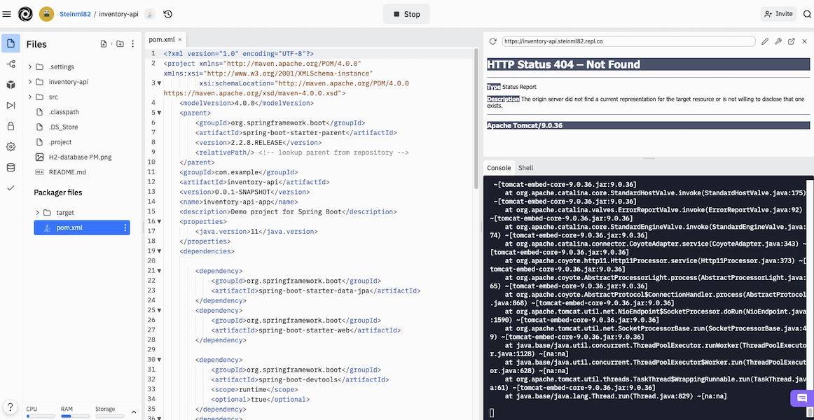

# Welcome to the inventory API

This app was built for use in the application process and I will guide you through the process of setting up this app and running the Crud commands.  

## Endpoints

| Crud operation     | Description |  Endpoint   | Notes/Example |
| :---        |    :----:   |   :----:   |          ---: |
| Get All Products      | Gets all products from table      |  /products/products | N/A |
| Get Product By Id   | Gets a product by it's unique id       |  /products/product/{productId} |  replace productId with unique id |
| Post Save Product     | Saves the product object into the product Table     |  /products/product | Request Body <pre>{<br>  "productname": "TEST TEST TEST TEST",<br>  "discription": "TEST TEST TEST TEST"<br>}</pre> |
| Put Add Product Inventory   | Adds quantity to the product "count" |  /products/product/{productId}/{quantity} |  Replace productId with unique id, quantity with number to add to inventory |
| Put Update   | Updates complete product object in table  |  /products/product/{productId}   |  Replace productId with unique id, Request Body <pre>{<br>  "productname": "TEST TEST TEST TEST",<br>  "discription": "TEST TEST TEST TEST"<br>}</pre> |
| Delete Product By Id   | Deletes a product by it's unique id       |  /products/product/{productId} |  Replace productId with unique id Note: As of May 16/ 2022 This endpoint may throw an error if you attempt to delete a product that is in an order. ResourceConflictException has been written but not implemented. |
| Get All Orders/Shipments     | Gets all Orders from table      |  /orders/orders | N/A |
| Get Orders/Shipments By Id   | Gets order from table by unique Id      |  /orders/order/{orderId} | Replace orderId with unique id in Order table |
| Post Save Order     | Given a complete order object, saves it to the order table     |  /orders/customer | Request Body <pre>{<br>    "customerid": {customerId},<br>    "comments": "Hello, World2",<br>    "items": [<br>        {<br>            "productid": 1,<br>            "quantity": 10<br>        }<br>    ]<br>} </pre> Replace customerId with any int. Customer object/table has not been implamented yes and is only there as context of what WOULD be needed in a shipment/order |
| Delete Orders/Shipments By Id   | Deletes Order from table by unique Id      |  /orders/order/{orderId} | Replace orderId with unique id in Order table |


## What is the H2 database you ask?  

 > H2 is an open-source lightweight Java database. It can be embedded in Java applications or run in the client-server mode. Mainly, H2 database can be configured to run as inmemory database, which means that data will not persist on the disk. Because of embedded database it is not used for production development, but mostly used for development and testing.
> 
>This database can be used in embedded mode or in server mode. Following are the main features of H2 database −
>
> - Extremely fast, open source, JDBC API
> - Available in embedded and server modes; in-memory databases
> - Browser-based Console application
> - Small footprint − Around 1.5MB jar file size
> source <https://www.tutorialspoint.com/h2_database/h2_database_introduction.htm>

## Replit 

This app is deployed on replit to test and spin up the server [here](https://replit.com/@Steinml82/inventory-api#src/main/resources/application.properties).


Just hit the run button and wait a few minuits for the api to boot up.  Once it has finished you should see  


A thing to note is the Http status 404. There is no HTML 

The api is now running at [https://inventory-api.steinml82.repl.co/](https://inventory-api.steinml82.repl.co/) and is ready to test with postman or any other api testing tool that use!

#### OR

## Setting up this project on Localhost
Running the project is easy, just:

- Go to the inventoryapi class and run the Main function.
This will start the application server on Apache Tomcat.

- Alternitivly, navigate to the root of the folder and in your command line and  run: 
 ```
 mvn spring-boot
 ```

- In your browser enter the URL <http://localhost:2019/h2-console/>. This will bring you to a screen that should look like this.  


- Click on the connect button and you should be good to go to monitor the in memory DB.

